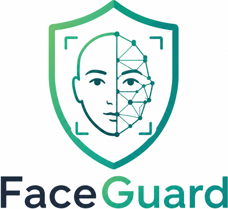

<div align="center">



**Détection de visages générés par intelligence artificielle**

Interface web locale s'appuyant sur un ResNet50V2 affiné par transfert d'apprentissage.


</div>

---

## Ce que fait le projet

On dépose la photo d'un visage, le modèle répond **REAL** ou **AI-GENERATED**
avec un score de confiance. Tout s'exécute en local : aucune image ne quitte la
machine, aucune n'est enregistrée sur le disque.

## Résultats

Mesurés sur le jeu de test, 5 714 images jamais vues pendant l'entraînement,
équilibrées à parts égales entre les deux classes.

| Métrique | Valeur |
|---|---|
| Accuracy | **89,64 %** |
| Precision | 87,32 % |
| Recall | 92,67 % |
| AUC | **96,30 %** |

Matrice de confusion :

| | prédit réelle | prédit générée |
|---|---|---|
| **image réelle** | 2 647 | 210 |
| **image générée** | 382 | 2 479 |

Les erreurs ne sont pas symétriques : 382 images générées passent pour réelles,
contre 210 vraies photos signalées à tort. C'est le sens d'erreur le plus
gênant, et il s'ajuste en déplaçant le seuil de décision sans réentraîner.

## Installation

Il faut **Python 3.10 ou 3.11** — TensorFlow ne supporte pas encore les
versions plus récentes.

```bash
git clone https://github.com/WafaaRahmoune/Fake-face-image-detection.git
cd Fake-face-image-detection

python -m venv .venv
# Windows
.venv\Scripts\activate
# macOS / Linux
source .venv/bin/activate

pip install -r requirements.txt
```

C'est tout : le modèle est inclus dans le dépôt (`models/resnet50v2_faceguard.keras`,
97 Mo), il n'y a rien d'autre à télécharger. Le clone est donc un peu long, mais
le projet fonctionne immédiatement.

## Lancement

```bash
# Windows
run.bat

# macOS / Linux
chmod +x run.sh && ./run.sh
```

Le navigateur s'ouvre sur <http://127.0.0.1:8000>. **Le premier démarrage prend
30 à 60 secondes** : c'est le temps d'importer TensorFlow et de construire le
réseau. Les prédictions suivantes sont immédiates. `Ctrl+C` pour arrêter.

## Guide de test

1. **Glisse une photo de visage** dans la zone pointillée, ou clique pour
   parcourir tes fichiers. Formats acceptés : JPG, PNG, JPEG.
2. **Clique sur « Analyze Image »**. La première analyse peut prendre une
   seconde ou deux, les suivantes sont instantanées.
3. **Lis le résultat.** L'anneau et la barre affichent la confiance ; le
   bandeau vert signale une photo authentique, le violet une image générée.

Pour un test représentatif :

- Prends **des visages centrés et cadrés serré** : le modèle a été entraîné
  sur ce type d'images et se dégrade sur des scènes larges ou des visages de
  profil.
- Teste **les deux classes**. Un test uniquement sur des vraies photos ne dit
  rien de la capacité à détecter les fausses.
- Pour des images générées, les sites de type *this-person-does-not-exist*
  fournissent des exemples immédiats.
- **Une erreur isolée n'est pas un échec** : le modèle se trompe environ une
  fois sur dix. Il faut une vingtaine d'images pour se faire une idée juste.

Le serveur expose aussi une petite API si tu veux automatiser :

```bash
curl http://127.0.0.1:8000/api/status
# {"modele": "resnet50v2_faceguard.keras", "taille_entree": 224}

curl -X POST http://127.0.0.1:8000/api/predict \
     -H "Content-Type: application/json" \
     -d '{"image": "data:image/jpeg;base64,..."}'
# {"label": "real", "score": 0.9214, "confiance": 92.1}
```

## Comment ça marche

### Le modèle

Un **ResNet50V2** pré-entraîné sur ImageNet, dont on a retiré la couche de
classification d'origine pour lui greffer une tête binaire :

```
Entrée 224 × 224 × 3
  └─ ResNet50V2 (pré-entraîné ImageNet, pooling moyen global)  → 2048 features
  └─ Dense 256, ReLU
  └─ BatchNormalization
  └─ Dropout 50 %
  └─ Dense 128, ReLU
  └─ Dropout 30 %
  └─ Dense 1, sigmoid          →  probabilité que l'image soit réelle
```

### L'entraînement, en deux temps

| | Phase 1 | Phase 2 |
|---|---|---|
| Base pré-entraînée | gelée | 100 dernières couches dégelées |
| Époques | 10 | 5 |
| Taux d'apprentissage | 10⁻³ | 10⁻⁵ |
| Arrêt | — | early stopping |

La base est gelée au départ parce que la tête démarre avec des poids
aléatoires : ses gradients sont énormes au premier passage et détruiraient les
poids pré-entraînés. Une fois la tête stabilisée, on dégèle le haut du réseau
avec un taux cent fois plus faible, pour l'ajuster sans l'abîmer.

### Le prétraitement

```
Undersampling → Resize 224×224 → Normalisation /255
   → Augmentation (rotation, zoom, décalage, fill_mode='nearest')
   → Mélange → Lots de 32
```

L'augmentation et le mélange ne s'appliquent **qu'à l'entraînement**.
Validation et test reçoivent les images intactes, sinon les métriques ne
seraient pas reproductibles.

### Deux détails à ne pas rater

**La normalisation n'est pas optionnelle.** Le modèle attend des pixels dans
`[0, 1]`, obtenus par simple division par 255. En lui envoyant des pixels bruts
`0-255`, il sature : il renvoie la même valeur pour toutes les images et
l'accuracy retombe à 50 %. Vérifié sur 600 images.

| Entrée | Accuracy | AUC |
|---|---|---|
| `x / 255` | **89,2 %** | **97,1 %** |
| pixels bruts `0-255` | 50,0 % | 10,9 % |

**Le sens de la sortie.** `flow_from_directory()` trie les dossiers par ordre
alphabétique, donc `fake` → 0 et `real` → 1. Une sortie sigmoid **proche de 1
signifie image réelle**.

## Structure du dépôt

```
FaceGuard/
├── app/
│   ├── server.py       serveur HTTP, bibliothèque standard uniquement
│   ├── model.py        chargement du modèle et prédiction
│   ├── page.html       interface complète : structure, styles, comportement
│   └── assets/         logo et illustrations
├── models/             le fichier de poids (non versionné, voir Releases)
├── notebooks/          notebook d'entraînement
├── requirements.txt
├── run.bat / run.sh
└── README.md
```

Trois fichiers seulement pour l'application, sans framework web ni build.
`page.html` est relu à chaque requête : on peut retoucher le design et
rafraîchir le navigateur sans redémarrer le serveur, donc sans recharger le
modèle.

## Dépannage

| Symptôme | Cause et solution |
|---|---|
| `Aucun modele trouve` | Le fichier n'est pas dans `models/`. Voir `models/README.md`. |
| `ValueError: Invalid dtype: tuple` | Un `.h5` sauvegardé avec Keras 3.8 lu par une version plus récente. `model.py` le détecte et reconstruit l'architecture automatiquement — si l'erreur remonte quand même, c'est que l'architecture du fichier diffère. |
| Le port 8000 est occupé | `set FACEGUARD_PORT=8080` (Windows) ou `FACEGUARD_PORT=8080 ./run.sh`. |
| `No module named tensorflow` | L'environnement virtuel n'est pas activé, ou `pip install -r requirements.txt` n'a pas été lancé. |
| Démarrage très lent | Normal au premier lancement. Au-delà de deux minutes, vérifie ta version de Python : 3.12+ n'est pas supporté par TensorFlow 2.20. |

## Technologies

**Deep learning** — TensorFlow, Keras, ResNet50V2 pré-entraîné sur ImageNet
**Données** — NumPy, Pillow, OpenCV, imagehash pour la déduplication
**Évaluation** — scikit-learn, Matplotlib, Seaborn
**Interface** — Python (bibliothèque standard), HTML, CSS, JavaScript sans framework
**Entraînement** — Kaggle, GPU
